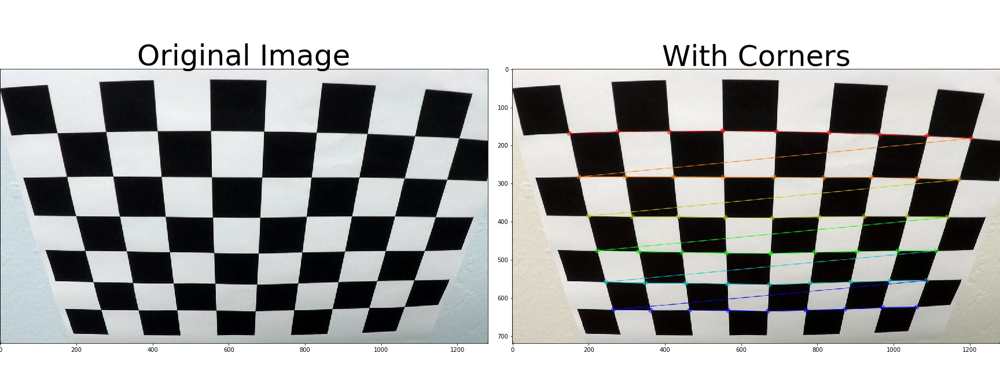
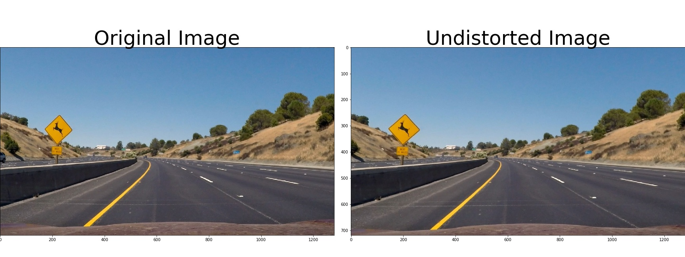
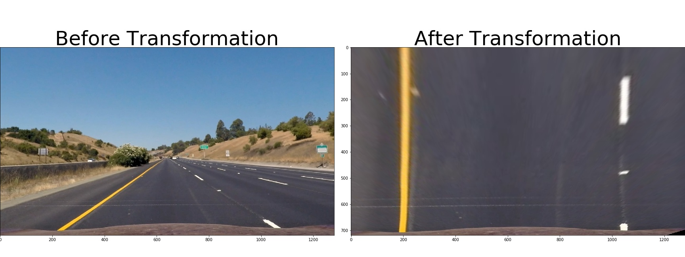
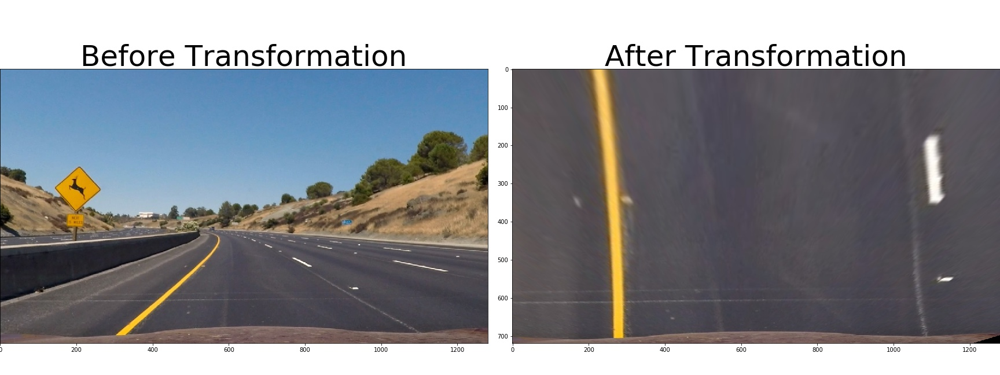
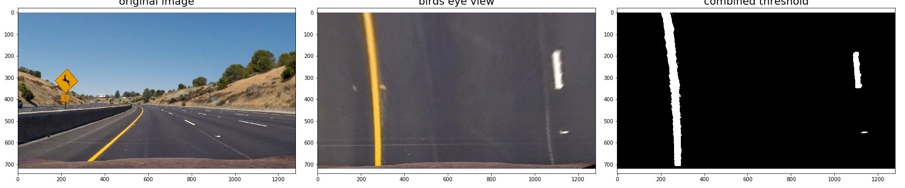
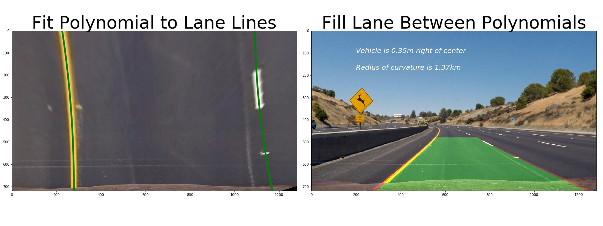

# Advanced Lane Line Finding

## Project goals / steps 

* Compute the camera calibration matrix and distortion coefficients given a set of chessboard images.
* Apply a distortion correction to raw images.
* Apply a perspective transform to rectify binary image ("birds-eye view").
* Use color transforms, gradients, etc., to create a thresholded binary image.
* Detect lane pixels and fit to find the lane boundary.
* Determine the curvature of the lane and vehicle position with respect to center.
* Warp the detected lane boundaries back onto the original image.
* Output visual display of the lane boundaries and numerical estimation of lane curvature and vehicle position.

### Step 1: Camera Calibration

I start by preparing "object points", which will be the (x, y, z) coordinates of the chessboard corners in the world. Here I am assuming the chessboard is fixed on the (x, y) plane at z=0, such that the object points are the same for each calibration image.  Thus, `objp` is just a replicated array of coordinates, and `objpoints` will be appended with a copy of it every time I successfully detect all chessboard corners in a test image.  `imgpoints` will be appended with the (x, y) pixel position of each of the corners in the image plane with each successful chessboard detection.  

---

### Step 2: Distortion Correction

I then used the output `objpoints` and `imgpoints` to compute the camera calibration and distortion coefficients using the `cv2.calibrateCamera()` function.  I applied this distortion correction to the test image using the `cv2.undistort()` function and obtained this result: 

 

---

### Step 3: Perspective Transformation

The code for my perspective transform is called ‘birds_eye()’.  The function takes as inputs an image (`img`), as well as source (`src`) and destination (`dst`) points.  I chose the source and destination points as follows:

| Source         |  Destination                                  | 
|:----:|:------:| 
| 530,  480      | offset_lr, offset_tb                          | 
| 760,  480      | img_width - offset_lr, offset_tb              |
| 1250, 720      | img_width - offset_lr, img_height-offset_tb   |
| 100,  720      | offset_lr, img_height-offset_tb               |

where offset_lr = 100 px and offset_tb = 0 px 

I verified that my perspective transform was working as expected by verifying with test image with straight lines: 

---

I then apply the same transformation on test images with curved lanes.Here's an example of my output for this step:

---

### Step 4: Binary Thresholding

I tried several thresholding methods and eventually end up with the following of combination of color thresholds to generate a binary image.  

| Name         |  Range                                  | 
|:----:|:------:| 
| yellow      | `cv2.inRange([20, 100, 100], [150, 255, 255])`                   | 
| white     | `cv2.inRange([190, 190, 190], [255, 255, 255])`              |
| b_threshold from Lab      | (5, 105)  |

Here's an example of my output for this step:

---

### Step 5 through 8: Lane Detection
I then detect the lane using sliding window histogram of the binary thresholded image and fitted the lane data with second order polynomial. Curvature and offset is then determined from the fitted parameter. An example of the test image is shown below:

---

### Pipeline (video)
The pipeline follows pretty much the steps for test images as I mentioned before. In case of facing “bad frames”, I added additional smoothing method. The “bad frame” consists three different scenarios:

* No points detected in the frame
* Lane lines predicted in the frame is too narrow or too wide
* change of predicted coefficients is greater than 20% of the averaged coefficients

When facing either one the these case, the predicted land line is substitute with the averaged predicted lane line of the previous 10 frames.

Here's a [link to my video result](./test_videos_output/project_video.mp4)

---

### Discussion

Throughout implementing the pipeline, there are several improvements can be made:

1.  First is the lane detection step. More accurate lane detection algorithm can save a lot of trouble for later video pipeline. I find that current implementation is not that good at identifying land lines under dark or extreme bright conditions. Additionally, right now the pipeline does not work for road that has continuous turns as well. Therefore, being able to automatically determining the region of interest can also improve the effectiveness of lane line detection

2. Another potential improvements is the on smoothing the output video. As demonstrated in the “challenge video”, output right now still contains some jittering frames. In addition to use information such as predicted landline width and coefficients, some other criterias such as slope of the lane lines and intersections of lane lines can also facilitate catching outliers that are otherwise missed and hence improving the smoothness of output videos.  